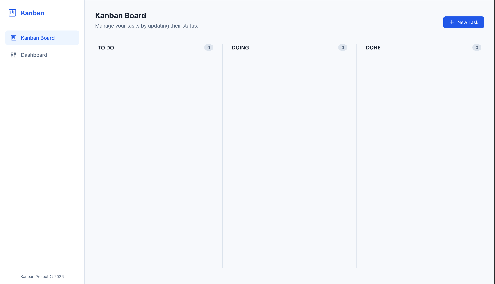
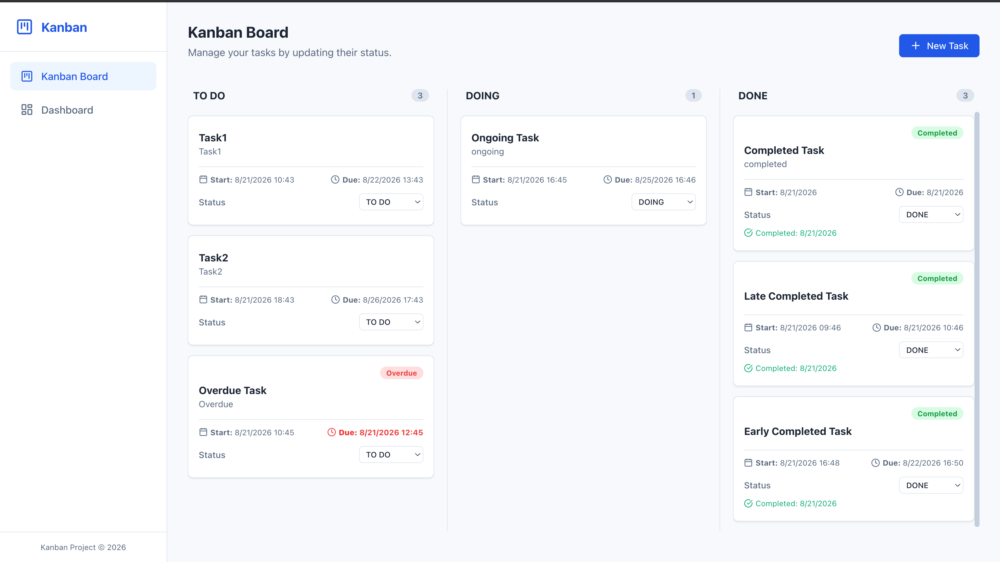
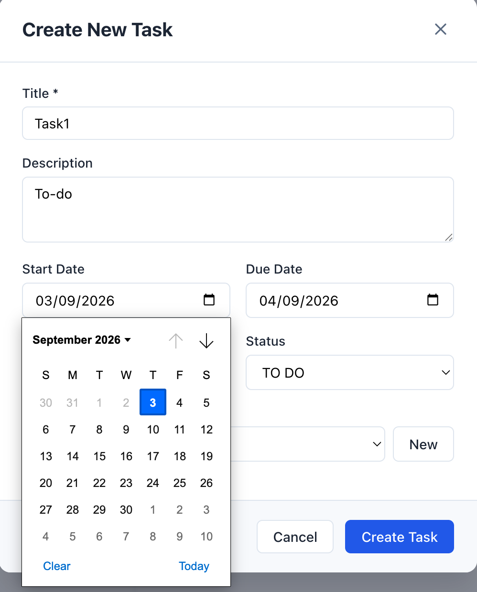
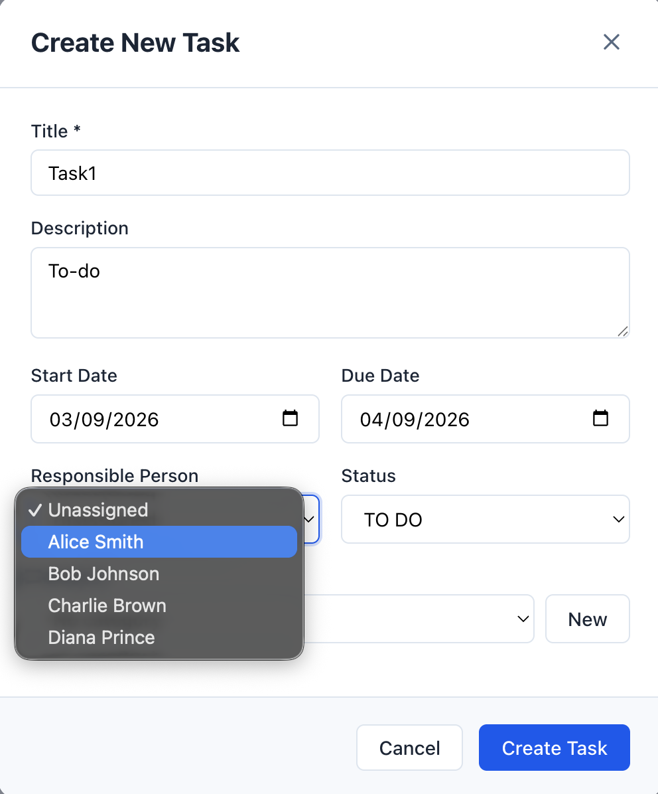

# Kanban Project

A React-based Kanban task management application for organizing project work. Users can create, edit, and delete tasks, assign categories and people, set due dates, and move tasks between `TO DO`, `DOING`, and `DONE` columns with drag and drop.

The project also includes a dashboard that summarizes task progress with status, category, completion-performance, and overdue-task statistics. Task and category data is stored in the browser's local storage, so it remains available after refreshing the page in the same browser.

## Features

- Create, edit, and delete tasks
- Task categories, assignees, priorities, descriptions, and due dates
- Automatic completion dates for finished tasks
- Dashboard charts and progress statistics
- Browser local storage persistence

## Tech Stack

- React
- Vite
- React Router
- Recharts
- Lucide React

## Basic Usage

### Prerequisites

- Node.js and npm installed

### Installation

```bash
npm install
```

### Start the development server

```bash
npm run dev
```

Open the local URL shown in the terminal, usually `http://localhost:5173`.

### Available commands

```bash
npm run build    # Create a production build
npm run preview  # Preview the production build locally
npm run lint     # Run Oxlint
```

### Using the application

1. Open the Kanban board at `/`.
2. Select **New Task** to create a task.
3. Drag tasks between the workflow columns to update their status.
4. Select a task to edit or delete it.
5. Open `/dashboard` to review progress statistics and charts.

## Screenshot





## Team Members

- Member 1: Min Khant Tin
- Member 2: Saw Lin Htet Oo
- Member 3: Min Khant Tin

